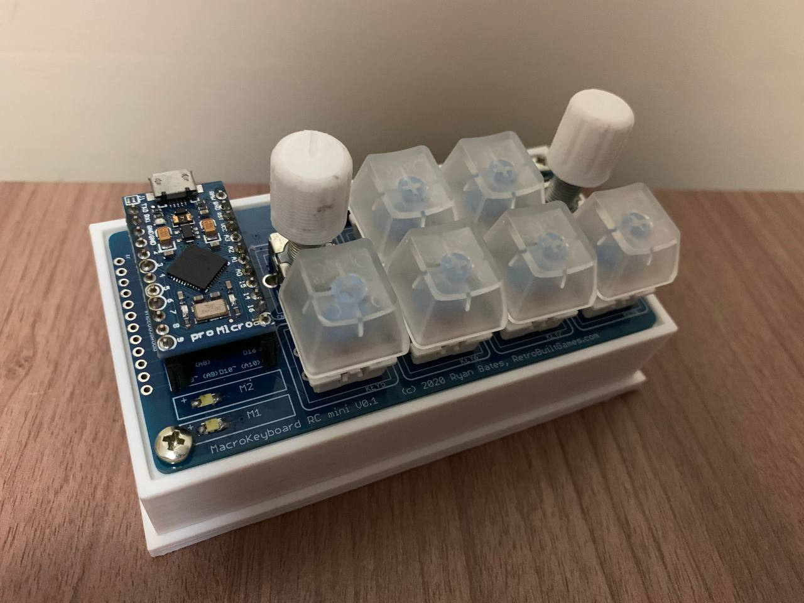

# MacroPad

My own firmware for the [Retro Built Games's MacroPad Mini](http://www.retrobuiltgames.com/the-build-page/macro-keyboard-v2-0/macro-keyboard-mini-v1-0/).

**(:warning: This project has no affiliation with Retro Build Games :warning:)**



## Why?

**Why not?** Having a small device capable of performing a custom macros is a grate idea. 

This firmware maps the MacroPad's buttons and rotary encoders to the F13-F14 keys (unused by normal keyboards), this keys inputs than can be mapped to a custom macro you want using scripts or programs like [AutoHotkey](https://www.autohotkey.com/).

## Keymaping

This firmware implements the following layout:
```yaml
Key Matrix:
  F13 | F14 | F15 | F16 
  F17 | F18 | F19 | F20

Left-Encoder:
  clockwise:        F21
  anti-clockwise:   F22

Rigth-Encoder:
  clockwise:        F23
  anti-clockwise:   F24

Layers:
  0: []
  1: [Ctrl]
  2: [Shift]
```

Layers can be selected by pressing "mode"button and are indicated by the LEDs:
```yaml
Layer 0: 
    LED1 = ON
    LED2 = OFF

Layer 0: 
    LED1 = OFF
    LED2 = ON

Layer 0: 
    LED1 = ON
    LED2 = ON
```

Example:

When having just the **LED2 on** and clicking the **second button of the first row** the MacroPad will send to the computer **```Ctrl + F14```**.


## Setup

### Hardware Side
For the hardware side you will need the macropad assembled:
- **MacroPad - Mini version** (Can be found [here](https://www.tindie.com/products/ryanbatesrbg/pcb-mini-programmable-macro-keyboard-encoders/))
- Arduino Pro-Micro
- Cherry MX Switch + Keycap (x6)
- Rotary Encoder w/ Switch + knob [987-1398-ND] (x2)
- Switch Tactile 6x6mm [679-2443-ND] (x2)	
- 1x12 Header 0.1" pitch [S6100-ND] (x2)	
- Diode [N4148W-13FDICT-ND] (x10)
- Resistor 1206, 1k ohm [RMCF1206JT1K00CT-ND] (x2)
- LED 1206 [732-4990-1-ND or 732-4989-1-ND] (x2)

For more information about the hardware side please check [Retrobuild's Blog](http://www.retrobuiltgames.com/the-build-page/macro-keyboard-v2-0/macro-keyboard-mini-v1-0/) or [Youtube video](https://www.youtube.com/watch?v=acJ6gufBN_A&list=RDCMUC2cpPe45iWKwrZc0OK8k-Pw&index=3)

### Software Side

This project requires [git](https://git-scm.com/) to be downloaded and uses [PlatformIO](https://platformio.org/) framework, please make sure you have both installed (For PlatformIO I recommend using the [VSCode Extension](https://marketplace.visualstudio.com/items?itemName=platformio.platformio-ide), [VSCode](https://code.visualstudio.com/) is a great lightweight editor and the plug-in works very well). 

In this guide the actions will be described using [PlatformIO's CLI](https://platformio.org/install/cli) (because it's easier to describe the steps), but can be performed in other ways ([VSCode Extension](https://marketplace.visualstudio.com/items?itemName=platformio.platformio-ide) has a very intuitive GUI).


#### Clone This Project

Clone the latest master version of this code:

- Option 1: HTTPS
```sh
$ git clone https://github.com/hbontempo-br/macro-pad.git
```

- Option 2: SSH
```sh
$ git clone git@github.com:hbontempo-br/macro-pad.git
```

#### Install Dependencies

```sh
$ pio lib install
```

#### Build Firmware

```sh
$ pio run --environment sparkfun_promicro16
```

#### Upload Firmware

Make sure you have the Arduino Pro-Micro installed

```sh
$ pio run --target upload --environment sparkfun_promicro16
```
PS: The Pro-Micro boot-loader can be a little tricky. Please check [Sparkfun's guide](https://learn.sparkfun.com/tutorials/pro-micro--fio-v3-hookup-guide/troubleshooting-and-faq) if you are having trouble.

## Testing and Code Static Analysis

PlatformIO provides a testing and code analysis tools but they are not used here, it would be a great addition and if you want to tackle this please open an issue and do it. This is a fast and small side project and I realistic won't put the required effort on implementing myself.

## Contributing

No fancy rules here. Saw an error, want a feature, have an improvement? Just open an issue and we will discuss.
